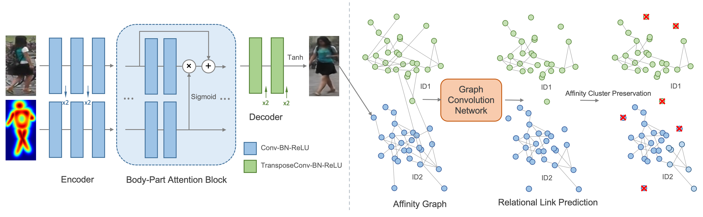
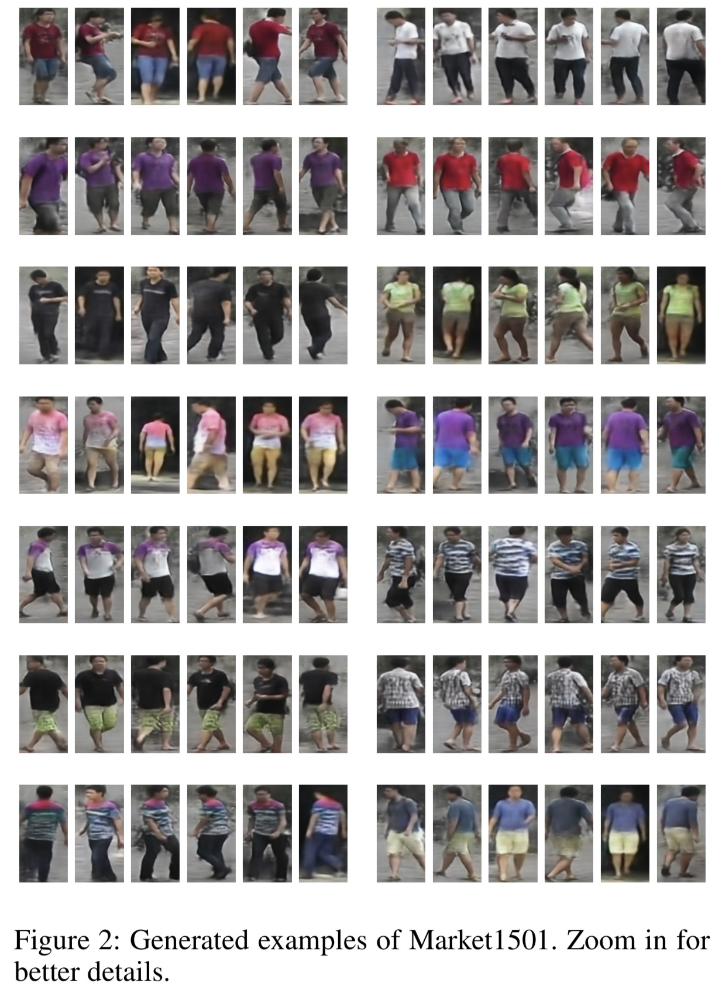
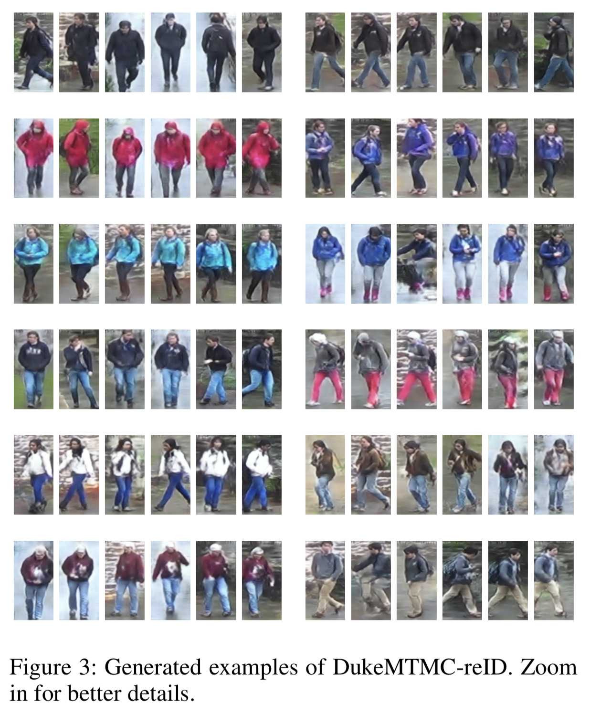
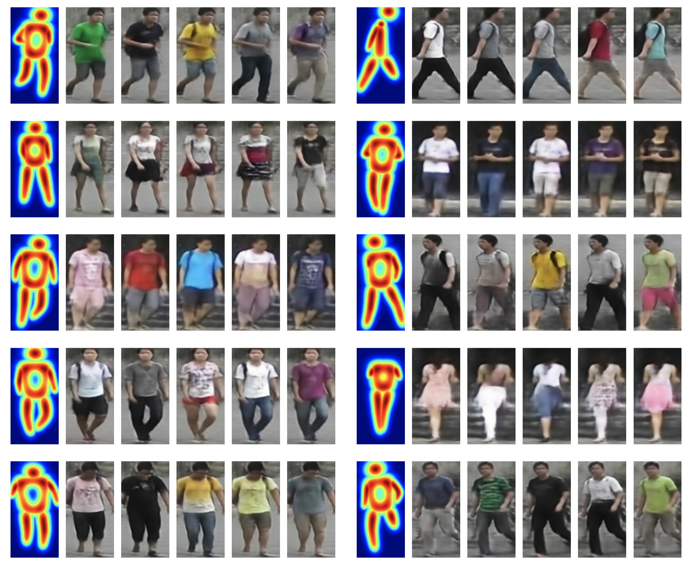

# Towards Efficient Data Generation for Person ReID
Paper: "Towards Efficient Data Generation for Person Re-Identification" (under review)

This temporary repository holds the codebase, data, and models for our paper.

## Pipeline
<div align=center>

</div>

## Visualized examples
### Market1501 and DukeMTMC
<div align=center>


</div>

### Changing Clothes
<div align=center>

</div>

## Directory layout

    .
    ├── data-generation-GAN     # training and testing code for data generation
    │   └── ...                 
    ├── data-purifying-GCN      # training and testing code for data purifying
    │   └── feature-extraction  # extract features for affinity graph construction
    │       └── ...             
    │   └── graph-clustering    # link prediction and data purifying
    │       └── ...             
    ├──  person-reid-baselines  # training and testing code for person reid             
    │       └── ...             
    ├── LICENSE
    └── README.md

## Prerequisites
1. `cd` to folder where you want to download this repo

2. Run `git clone https://github.com/4review/paper1370.git`

3. Install dependencies:
    - python3 (>=3.5)
    - [pytorch (>=0.4)](http://pytorch.org/)
    - torchvision
    - opencv (3.1.0)
    - scikit-image
    - pandas
    - [yacs (0.1.4)](https://github.com/rbgirshick/yacs)

4. Prepare dataset
    - Download the [Market1501](http://www.liangzheng.com.cn/Datasets.html) and [DukeMTMC-reID](http://vision.cs.duke.edu/DukeMTMC/details.html)
    - Download the train/test splits and train/test key points annotations from [Google Drive](https://drive.google.com/open?id=1q2NzY7QjrfhgUbEG5SOBjGKXkXdZrIDz) or [Baidu Disk](https://pan.baidu.com/s/1V3FKaWtONeEdwmntofspTg) with extraction code `9e34`, including **market-pairs-train.csv, market-pairs-test.csv, market-annotation-train.csv, market-annotation-train.csv, duke-pairs-train.csv, duke-pairs-test.csv, duke-annotation-train.csv, duke-annotation-train.csv**
    - Generate the body-part heatmaps, run
    ```bash
    python /data-generation-GAN/tool/generate_part_heatmap.py
    ```
5. Prepare pretrained models if you don't have
    - Download the pretrained models from [Google Drive](https://drive.google.com/open?id=1q2NzY7QjrfhgUbEG5SOBjGKXkXdZrIDz) or [Baidu Disk](https://pan.baidu.com/s/1V3FKaWtONeEdwmntofspTg), including **gan_market.pth, gan_duke.pth, resnet50_person_reid_gan.pth, resnet50_person_reid_gcn.pth, gcn_20.pth, gcn_20_duke**

## Testing pretrained models
### Evaluation on person re-identification
1. To generate person images, modify the paths of root, datasets, pre-trained models, output in `data-generation-GAN/config/cfg.py` and run
```bash
python data-generation-GAN/generate_samples_market.py
python data-generation-GAN/generate_samples_duke.py
```
2. To prepare features for graph convolutional network (GCN), modify the path of generated data in `data-purifying-GCN/feature-extraction/datasets/NewDataset.py` and modify the path of pre-trained model in `data-purifying-GCN/feature-extraction/config/cfg.py`. Run
```bash
python data-purifying-GCN/feature-extraction/get_feats.py
```
3. `cd data-purifying-GCN/graph-clustering/` and prepare data for GCN
```bash
python convert_npy_for_gcn.py
```
4. To purify generated data using GCN, modify the path of pretrained model in `./config/cfg.py` and run
```bash
python test.py
python purify.py
```
5. To test reID performance, `cd .. && cd .. && cd person-reid-baselines`, modify the data path in `main.py` of each baseline and run
```bash
python main.py
```

### Evaluation on person generation
1. Modify the paths of root, datasets, pre-trained models, and output in `data-generation-GAN/config/cfg.py`
2. To evaluate SSMI of our generated results on Market1501, run
```bash
python test.py
```
3. To evaluate FID of our generated results on Market1501, run
```bash
python tool/pytorch-fid/fid_score.py path/to/fake_imgs path/to/target_imgs
```

## Training
1. To train your own generative model, modify the paths of root, datasets, and output in `data-generation-GAN/config/cfg.py`, and run
```bash
python data-generation-GAN/train.py
```
2. To train your own gcn model, modify the paths of dataset and output in `data-purifying-GCN/graph-clustering/config/cfg.py`, and run
```bash
python graph-clustering/train.py
```


## Citation
Please cite the following paper if you use this repository in your reseach.
TBD

## Acknowledgment
TBD

## Contact
TBD

**用我的AI大师码0003在滴滴云上购买GPU/vGPU/机器学习产品可享受9折优惠，[点击](https://www.didiyun.com)前往滴滴云官网**
